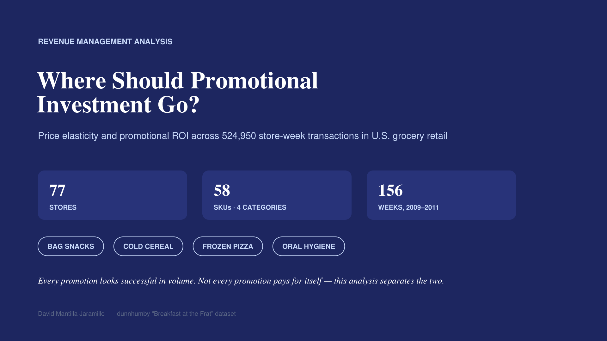
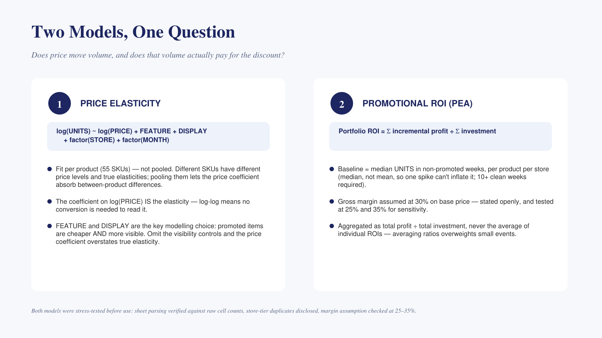
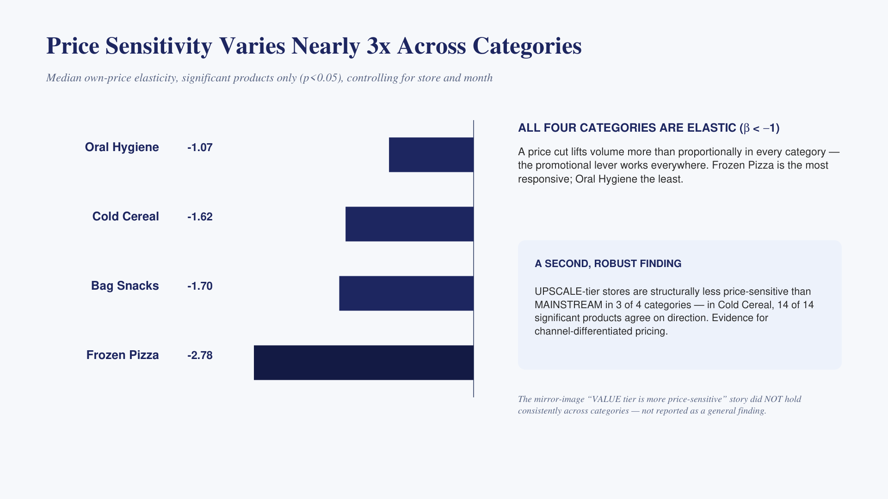
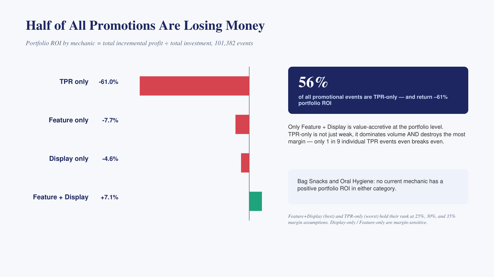
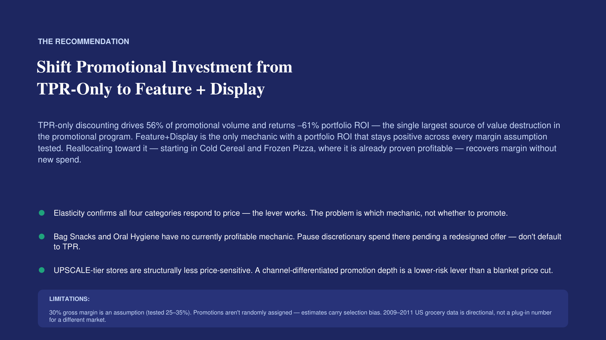

# Promotional Effectiveness Analysis and Price Elasticity

A revenue-management style analysis about the price elasticities and promotional ROI in the grocery retail market in USA. 
Built as a portfolio project for revenue management / Commercial analytics roles in FMCG.

**3-minute version of everything below:**

<br>
<br>
<br>
<br>


*([PDF](RGM_Promotional_Effectiveness.pdf) and [editable .pptx](RGM_Promotional_Effectiveness.pptx) also available.)*

## The question:

Every promotion looks successful in volume - units increase when price decreases. But not all promotions are paid for by themselves once you account for the margin given away. This analysis asks: "which promotional mechanisms and categories are realistically creating value, and which destroy it?

## Dataset

[dunnhumby's 'Breakfast at the Frat'](https://dunnhumby.com/source-files/)

A dataset that scans public retail market covering 77 affiliates of Kroger stores, 58 SKUs through 4 categories (bag snacks, cold cereal, frozen pizza, oral hygiene products), and 156 weeks (January 2009 - January 2012). Around 525K store-week-product transaction rows after cleaning.

This is an academic public dataset, not proprietary data; it's discussed here deliberately. The value of this project is the modeling and the judgement calls, not access to data in itself. *(The raw workbook is not redistributed in this repo, check dunnhumby's source files terms before re-hosting the original file)*

## Method

1. Price Elasticity: adjusted per product (not pooled across products - pooling would let the price coefficient absorb between product price-level differences): 

```
log(UNITS) ~ log(PRICE) + FEATURE + DISPLAY + factor(STORE_NUM) + factor(MONTH)
```

'FEATURE' and 'DISPLAY' are deliberately included: promoted products are cheaper and more visible. Omit the visibility controls and the price coefficient overstates the true elasticity as it absorbs the visibility effect. 

2. Post-event promotional ROI (PEA): Mirroring what an RGM retail team does with a PEA tool, baseline = median units in non-promoted weeks per product-store (at least 10 weeks of clean data are required); incremental profit at an assumed 30% gross margin (tested 25-35% for sensitivity); (portfolio ROI = total incremental profit / total investment). Never the mean of individual ROIs, can overweight small events.

## Main Findings

- All four categories are price elastic (median β from -1.07 to -2.78), Frozen Pizza being the most receptive product, oral hygiene the least.
- TPR-only discounting is 56% of all promotional volume and returns -61% portfolio ROI, the largest source of margin destruction in promotional programs. Only 1 out of 9 individual TPR events gets to the break even point.
- FEATURE + DISPLAY is the only mechanism with a positive ROI in the portfolio (+7%), and it is the only one which sign is robust across the 25-35% margin sensitivity range.
- Bag snacks and Oral Hygiene do not have a profitable mechanic currently, every combination in the category x mechanic grid loses money.
- UPSCALE-tier stores are structurally less price-sensitive than MAINSTREAM in 3 of 4 categories (statistically significant, mostly unanimous direction across SKUs) - evidence for channel-differentiated pricing. The intuitive claim ("VALUE tier is more price-sensitive") does NOT hold in general and it is not presented as a finding.

## Recommendation

Shifting the promotional investment from TPR-only to a Feature + Display can improve ROI, starting with cold cereals and frozen pizza where it has been demonstrated that it is profitable. Pause discretionary spending in bag snack and oral hygiene promotion, pending a redesigned offer. Treat UPSCALE-tier stores like a candidate for a differentiated (shallower) promotion depth instead of just blanket discounting.

## Limitations (stated deliberately, not hidden)
- 30% gross margin is an assumption, not observed data.
- The baseline for median non-promoted volume is a simplification; advanced RGM tools model baseline with trend and seasonality.
- Data might be outdated 2009-2012, not current or European FMCG
- No competitor pricing, therefore cross-price effects go unobserved.
- Two stores had a conflict in their tier label; resolved by keeping the first occurrence and disclosing it(see 'rgm_analysis.R')

## Repository contents

| File | What it is |
|---|---|
| `rgm_analysis.R` | Full, commented analysis pipeline — run top to bottom |
| `RGM_Promotional_Effectiveness.pptx` | 5-slide narrative deck |
| `out_*.csv` | Every result table, for Excel / further analysis |
| `chart_*.png` | Standalone chart exports |

To reproduce: open `rgm_analysis.R` in RStudio, set `FILE` to the workbook
path, run top to bottom. Each section prints a sanity check before the next
one runs.

## Tooling

Analysis written in R and developed with AI-assisted coding (Claude Code). The research questions, model specification, baseline definition, margin assumptions and commercial interpretation are written by myself; AI was used for code review, debugging and implementation. 

---
David Mantilla Jaramillo — www.linkedin.com/in/david-mantilla-j · dmantilla500@gmail.com
